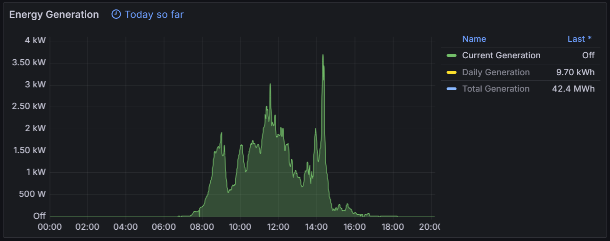

# Solis Inverter Exporter ☀️📈

## Overview 📊

This script collects and exports key metrics from Solis inverters to Prometheus. It tracks important data points such as <ins>Current Generation</ins>, <ins>Daily Generation</ins>, and <ins>Total Generation</ins>. This allows you to monitor the performance of your inverter with ease.

<div align="center">
   
</div>

## Features 🌟

- **Metrics Collection:** Retrieves <ins>power output</ins>, <ins>energy produced today</ins>, and <ins>total energy produced</ins> from Solis inverters.
  
- **Prometheus Integration:** Provides metrics in a format compatible with Prometheus scraping.
  
- **Simple Configuration:** Easy to set up with minimal configuration required.
  
- **Reliable Data Fetching:** Automatically retries in case of network or data fetching errors.

## Configuration ⚙️

1. **Device Configuration:**

   Update the following variables with your Solis inverter details:

   ```python
   # Device Configuration
   IP = "INVERTER_IP"
   USERNAME = "INVERTER_USERNAME"
   PASSWORD = "INVERTER_PASSWORD"
   ```

- `IP`: IP address of your Solis inverter.
- `USERNAME`: Username for your Solis inverter.
- `PASSWORD`: Password for your Solis inverter.

2. **Exporter Port (Optional):**

   Set the port for the Prometheus exporter:

   ```python
   PORT = 8686
   ```

## Usage 🚀

1. **Install Dependencies:**

   Install the required Python packages:

   ```sh
   pip install prometheus_client requests beautifulsoup4
   ```

   2. **Run the Script:**

   Launch the script to start the Prometheus exporter:

   ```sh
   python solis_exporter.py
   ```

3. **Access Metrics:**

   After running the script, you can access the metrics at:
    
     ```init
     http://localhost:8686/metrics
     ```

## Notes 📝

- **Prometheus Data Fetching:** The script continuously fetches data from the inverter and exposes it in Prometheus format. Ensure that your inverter is accessible from the script's host.
  
- **Configuration:** Verify that the IP address, username, and password for your inverter are correctly set. These settings are crucial for data retrieval.

## License 📄

This project is licensed under the MIT License - see the [LICENSE](LICENSE) file for details.
