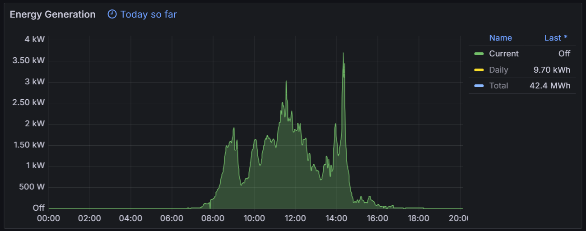

# Solis Inverter Exporter 📈

## Overview 📊

This script collects and exports key metrics from Solis inverters to Prometheus. It tracks important data points such as <ins>power output</ins>, <ins>energy produced today</ins>, and <ins>total energy produced</ins>. This allows you to monitor the performance of your inverter with ease.

<div align="center">
   
</div>

## Features 🌟

- **Metrics Collection:** Retrieves <ins>power output</ins>, <ins>energy produced today</ins>, and <ins>total energy produced</ins> from Solis inverters.
  
- **Prometheus Integration:** Provides metrics in a format compatible with Prometheus scraping.
  
- **Simple Configuration:** Easy to set up with minimal configuration required.
  
- **Reliable Data Fetching:** Automatically retries in case of network or data fetching errors.

## Configuration ⚙️

1. **Device Configuration:**

   Update the following variables with your Solis inverter details:

   ```python
   # Device Configuration
   IP = "INVERTER_IP"
   USERNAME = "INVERTER_USERNAME"
   PASSWORD = "INVERTER_PASSWORD"
   ```
