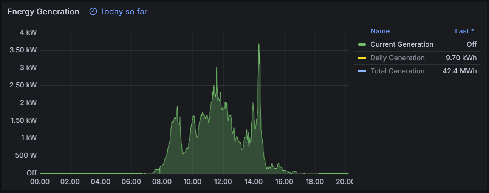

<h1 align="center">Solis Inverter Exporter ☀️</h1>

<p align="center">
  
</p>

Prometheus exporter for **Solis inverters** using the local web interface (`/status.html`).

It polls the inverter on your LAN on an interval and exposes metrics on `/metrics`.  
Prometheus scraping does **not** trigger extra requests. The exporter serves cached values until the next poll cycle.

<p align="center">
  
</p>

## Contents

### 📦 Binary downloads

- 🐧 [Linux arm64 binary](#linux-arm64-)
- 🐧 [Linux amd64 binary](#linux-amd64-)
- 🪟 [Windows amd64 binary](#windows-amd64-)

### 🐳 Docker

- 🐧 [Linux/macOS Docker](#linuxmacos-)
- 🪟 [Windows PowerShell Docker](#windows-powershell-)

### 🛠️ Setup

- 🔧 [Configure `config.yaml`](#configuration-)
- ✅ [Verify exporter](#verify-)

## Features 📊

- Metrics on `/metrics`
- Multi-inverter support
- Parallel polling with `max_parallel`
- Cached values between poll cycles
- Stale handling for night-time offline inverters
  - after `stale_seconds`, power is forced to `0`
  - last energy counters are kept
- Optional network and device info metrics
  - network info as labels: SSID, IP, MAC, mode
  - device info as labels: serial and firmware versions
- Health and readiness endpoints
  - `/-/healthy` or `/healthz`
  - `/-/ready` or `/readyz`
- Docker support through GitHub Container Registry
- Prebuilt binaries for Linux and Windows

## Requirements

- Network access to the inverter web UI on the local LAN
- Inverter web credentials
- A `config.yaml` file

## Install 📥

You can run this exporter with a prebuilt binary or with Docker.

Recommended options:

| Method | Best for |
|---|---|
| 📦 Binary | Raspberry Pi, Linux servers, Windows testing |
| 🐳 Docker | Servers, homelabs, containerized monitoring stacks |

## Option 1: Run from binary 📦

Download the binary for your system from the latest GitHub Release.

| System | Asset |
|---|---|
| 🐧 Linux amd64 | `solis-inverter-exporter-linux-amd64` |
| 🐧 Linux arm64 | `solis-inverter-exporter-linux-arm64` |
| 🪟 Windows amd64 | `solis-inverter-exporter-windows-amd64.exe` |

### Linux arm64 🐧

Use this for Raspberry Pi OS 64-bit and other Linux ARM64 systems.

```bash
mkdir -p solis-inverter-exporter
cd solis-inverter-exporter

curl -fL -o solis-inverter-exporter-linux-arm64 https://github.com/luizbizzio/solis-inverter-exporter/releases/latest/download/solis-inverter-exporter-linux-arm64
curl -fL -o config.example.yaml https://github.com/luizbizzio/solis-inverter-exporter/releases/latest/download/config.example.yaml

chmod +x solis-inverter-exporter-linux-arm64
cp config.example.yaml config.yaml
nano config.yaml

./solis-inverter-exporter-linux-arm64 --config-file config.yaml
```

### Linux amd64 🐧

Use this for most Linux PCs, servers, and VMs.

```bash
mkdir -p solis-inverter-exporter
cd solis-inverter-exporter

curl -fL -o solis-inverter-exporter-linux-amd64 https://github.com/luizbizzio/solis-inverter-exporter/releases/latest/download/solis-inverter-exporter-linux-amd64
curl -fL -o config.example.yaml https://github.com/luizbizzio/solis-inverter-exporter/releases/latest/download/config.example.yaml

chmod +x solis-inverter-exporter-linux-amd64
cp config.example.yaml config.yaml
nano config.yaml

./solis-inverter-exporter-linux-amd64 --config-file config.yaml
```

### Windows amd64 🪟

Use Windows amd64 for most Windows PCs.

Run these commands in PowerShell.

```powershell
New-Item -ItemType Directory -Force -Path solis-inverter-exporter
Set-Location solis-inverter-exporter

Invoke-WebRequest -Uri "https://github.com/luizbizzio/solis-inverter-exporter/releases/latest/download/solis-inverter-exporter-windows-amd64.exe" -OutFile "solis-inverter-exporter-windows-amd64.exe"
Invoke-WebRequest -Uri "https://github.com/luizbizzio/solis-inverter-exporter/releases/latest/download/config.example.yaml" -OutFile "config.example.yaml"

Copy-Item config.example.yaml config.yaml
notepad config.yaml

.\solis-inverter-exporter-windows-amd64.exe --config-file config.yaml
```

## Option 2: Run with Docker 🐳

The exporter is available on GitHub Container Registry.

The container is stateless and does not include configuration or credentials.
Create a local `config.yaml` file first, then mount it to `/config/config.yaml`.

### Linux/macOS 🐧

```bash
mkdir -p solis-inverter-exporter
cd solis-inverter-exporter

curl -fL -o config.example.yaml https://github.com/luizbizzio/solis-inverter-exporter/releases/latest/download/config.example.yaml

cp config.example.yaml config.yaml
nano config.yaml

docker run -d \
  --name solis-inverter-exporter \
  -p 9121:9121 \
  -v "$(pwd)/config.yaml:/config/config.yaml:ro" \
  --restart unless-stopped \
  ghcr.io/luizbizzio/solis-inverter-exporter:latest
```

### Windows PowerShell 🪟

Run these commands in PowerShell or in Windows Terminal with a PowerShell tab.

```powershell
New-Item -ItemType Directory -Force -Path solis-inverter-exporter
Set-Location solis-inverter-exporter

Invoke-WebRequest -Uri "https://github.com/luizbizzio/solis-inverter-exporter/releases/latest/download/config.example.yaml" -OutFile "config.example.yaml"

Copy-Item config.example.yaml config.yaml
notepad config.yaml

docker run -d `
  --name solis-inverter-exporter `
  -p 9121:9121 `
  -v "${PWD}\config.yaml:/config/config.yaml:ro" `
  --restart unless-stopped `
  ghcr.io/luizbizzio/solis-inverter-exporter:latest
```

### Container health

This container includes a built-in Docker healthcheck.

- Liveness: `/-/healthy`
- Readiness: `/-/ready`

A healthy container means the exporter HTTP server is running.
It does not guarantee that all inverters are reachable or returning telemetry.

Use `solis_inverter_up` and `solis_inverter_stale` to validate inverter state.

## Verify ✅

The exporter listens on port `9121` by default.

- Metrics: `http://localhost:9121/metrics`
- Health: `http://localhost:9121/-/healthy`
- Ready: `http://localhost:9121/-/ready`

🐧 Linux/macOS:

```bash
curl http://localhost:9121/metrics
curl http://localhost:9121/-/healthy
curl http://localhost:9121/-/ready
```

🪟 Windows PowerShell:

```powershell
Invoke-WebRequest http://localhost:9121/metrics
Invoke-WebRequest http://localhost:9121/-/healthy
Invoke-WebRequest http://localhost:9121/-/ready
```

## Configuration 🔧

### Getting inverter credentials

To use this exporter, you need access to the local Solis inverter or logger web interface.

You need:

- inverter/logger IP address
- username
- password

The exporter reads the local status page, usually:

```text
http://INVERTER_IP/status.html
```

Authentication can be Basic or Digest depending on the device.

### Config file

Create a `config.yaml` file before running the exporter.

The exporter looks for `config.yaml` in:

- current directory
- executable or script directory
- `/config/config.yaml`

You can also pass it explicitly:

```bash
./solis-inverter-exporter-linux-arm64 --config-file config.yaml
```

Or with environment variable:

```bash
SOLIS_INVERTER_EXPORTER_CONFIG=config.yaml ./solis-inverter-exporter-linux-arm64
```

### Example config

Copy `config.example.yaml` to `config.yaml` and replace the example values.

```yaml
server:
  host: "0.0.0.0"
  port: 9121
  expose_default_metrics: false
  log_level: INFO

scrape:
  poll_interval_seconds: 30
  timeout_seconds: 10
  retries: 3
  retry_backoff_seconds: 1
  max_parallel: 4
  stale_seconds: 300

features:
  network_info: true
  device_info: true

solis:
  - name: inverter-1
    host: "IP_ADDRESS"
    username: "INVERTER_USERNAME"
    password: "INVERTER_PASSWORD"
    scheme: "http"
    path: "/status.html"
```

### Config notes

- `stale_seconds: 300` is a good default for night-time offline inverters.
- `expose_default_metrics: true` also exposes default `python_*` and `process_*` metrics.
- `features.network_info` exposes SSID, IP, and MAC labels.
- `features.device_info` exposes serial and firmware labels.
- Disable `network_info` and `device_info` if you do not want that data stored in Prometheus labels.

## Prometheus scrape config

Add this to your Prometheus config:

```yaml
scrape_configs:
  - job_name: "solis-inverter-exporter"
    static_configs:
      - targets: ["YOUR_EXPORTER_IP:9121"]
```

## Metrics 📈

| Name | Type | Description | Scope |
|---|---|---|---|
| `solis_inverter_exporter_build_info` | Info | Exporter version | Global |
| `solis_inverter_exporter_ready` | Gauge | 1 if exporter has completed at least one successful poll cycle | Global |
| `solis_inverter_up` | Gauge | Last poll succeeded (1) or failed (0) | Inverter |
| `solis_inverter_last_attempt_timestamp` | Gauge | Unix timestamp of last poll attempt | Inverter |
| `solis_inverter_last_success_timestamp` | Gauge | Unix timestamp of last successful poll | Inverter |
| `solis_inverter_scrape_duration_seconds` | Gauge | Duration of last inverter poll | Inverter |
| `solis_inverter_errors_total` | Counter | Total poll errors | Inverter |
| `solis_inverter_stale` | Gauge | 1 if data is stale, else 0 | Inverter |
| `solis_inverter_last_success_age_seconds` | Gauge | Seconds since last success (-1 if never) | Inverter |
| `solis_inverter_power_watts` | Gauge | Current AC power in watts. Forced to 0 after stale | Inverter |
| `solis_inverter_energy_today_kwh` | Gauge | Energy produced today in kWh | Inverter |
| `solis_inverter_energy_total_kwh` | Gauge | Total energy produced in kWh | Inverter |
| `solis_inverter_rated_power_watts` | Gauge | Rated power in watts, if available | Inverter |
| `solis_inverter_uptime_seconds` | Gauge | Uptime seconds, if available | Inverter |
| `solis_inverter_alarm_present` | Gauge | 1 if alarm field is present, else 0 | Inverter |
| `solis_remote_status_a` | Gauge | Remote status A: 1 enabled, 0 disabled, -1 unknown | Inverter |
| `solis_remote_status_b` | Gauge | Remote status B: 1 enabled, 0 disabled, -1 unknown | Inverter |
| `solis_remote_status_c` | Gauge | Remote status C: 1 enabled, 0 disabled, -1 unknown | Inverter |
| `solis_sta_rssi_percent` | Gauge | STA RSSI percent | Inverter |
| `solis_inverter_network_info` | Gauge | Network info as labels | Inverter |
| `solis_inverter_device_info` | Gauge | Device info as labels | Inverter |

## Troubleshooting 🔍

If `solis_inverter_up = 0`:

- Check IP and that the inverter web UI is reachable.
- Confirm username and password.
- Try opening `http://INVERTER_IP/status.html` in a browser from the same network.
- Increase `scrape.timeout_seconds` if your inverter is slow.
- Check firewall rules and LAN routing.

If power becomes `0` at night:

- This is expected if the inverter goes offline.
- Power is forced to `0` only after `stale_seconds` since last success.
- Last energy counters are kept.

If you do not want SSID, MAC, IP, or serial data in Prometheus:

- Set `features.network_info: false`
- Set `features.device_info: false`

## Security notice ⚠️

This exporter requires access to inverter web credentials:

- username
- password

These values can allow local access to your inverter depending on the tool using them.
This exporter only reads telemetry and does not change inverter settings.

Network and device info can expose SSID, IP, MAC address, serial number, and firmware data as Prometheus labels.
Disable `network_info` and `device_info` if you do not want this data stored in Prometheus.

Do not commit your real credentials to GitHub.

Use `config.example.yaml` in the repository and keep your real `config.yaml` local.

## License 📄

This project is licensed under the [Apache License 2.0](./LICENSE).

